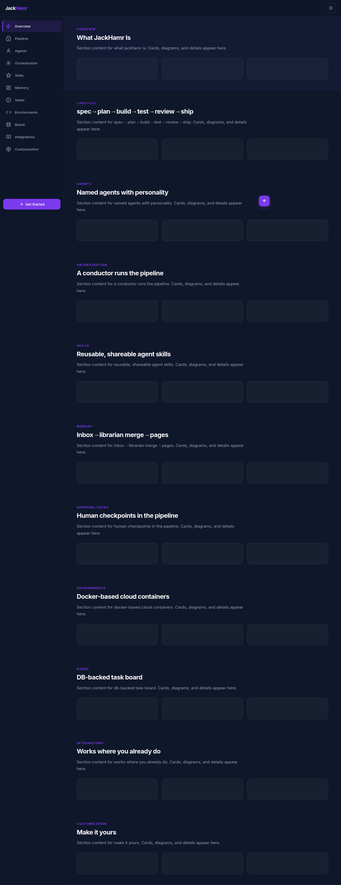
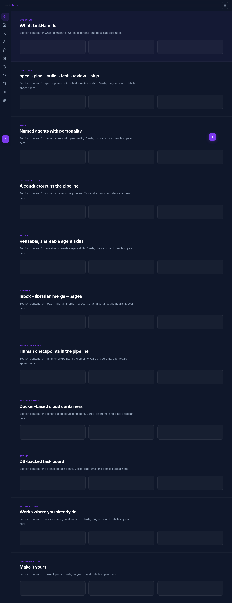
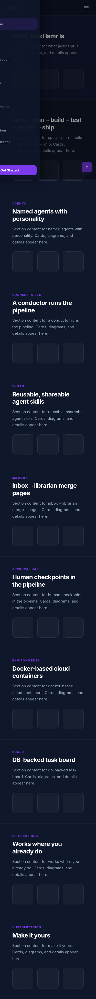
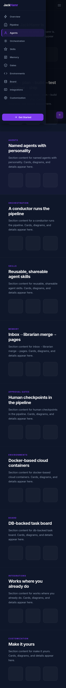
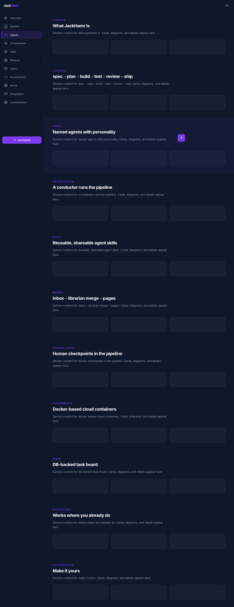
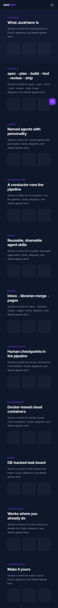
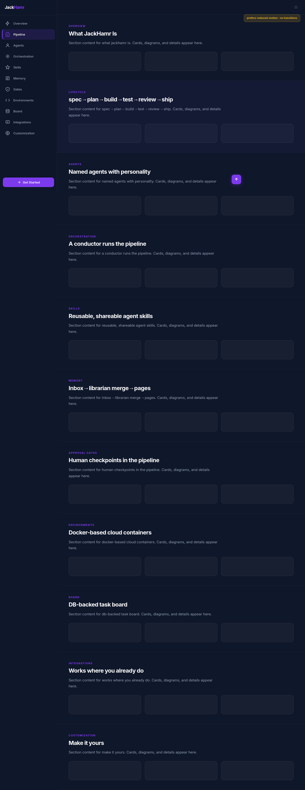

# Collapsible Left Sidebar Navigation — Technical & Functional Specification

**Feature:** Convert the JackHamr documentation website's sticky top nav bar into a collapsible left sidebar navigation with an icon-only collapsed state and a mobile slide-out drawer.
**Date:** 2026-07-13
**Version:** 1.0
**Status:** Planned — ready for implementation
**Branches:** N/A (single-file `index.html` enhancement)

---

## Table of Contents

1. [Feature Overview](#1-feature-overview)
2. [Architecture Diagram](#2-architecture-diagram)
3. [Component Map](#3-component-map)
4. [API Reference](#4-api-reference)
5. [Data Schema](#5-data-schema)
6. [Protocol / Event Reference](#6-protocol--event-reference)
7. [State Machine](#7-state-machine)
8. [Message / Data Flow Diagrams](#8-message--data-flow-diagrams)
9. [Visual Mockups](#9-visual-mockups)
10. [Implementation Status](#10-implementation-status)
11. [Gap Analysis](#11-gap-analysis)
12. [Testing Requirements](#12-testing-requirements)
13. [Test Coverage Map](#13-test-coverage-map)
14. [Known Edge Cases](#14-known-edge-cases)
15. [Acceptance Criteria](#15-acceptance-criteria)
16. [Out of Scope](#16-out-of-scope)
17. [Open Questions](#17-open-questions)
18. [Persistence / Session Behaviour](#18-persistence--session-behaviour)

---

## 1. Feature Overview

### What this feature does

The JackHamr documentation website is currently a single-page HTML file with a sticky top navigation bar containing 11 section links, a "Get Started" CTA button, and a hamburger menu for mobile. This feature converts that top nav into a **collapsible left sidebar** that persists on desktop (expandable to ~240px with icons + labels, collapsible to ~60px icon-only strip) and becomes a **slide-out drawer** on mobile (<768px). The sticky top bar is retained but slimmed down to brand + toggle controls only. All 11 content sections, scroll reveal animations, pipeline phase lighting, and existing interactivity are preserved.

### End-to-end user journey

**Desktop (≥768px):**
1. User loads the page. The left sidebar appears expanded (~240px) with section icons and text labels visible.
2. The slim top bar shows the "JackHamr" brand on the left and a collapse toggle button on the right.
3. The main content area is shifted right by 240px to respect the sidebar — content is no longer full-bleed.
4. User clicks a sidebar link. The page smooth-scrolls to that section. The active section is highlighted in the sidebar.
5. User clicks the collapse toggle. The sidebar animates to a 60px icon-only strip over 0.3s. The content area shifts left to fill the reclaimed space.
6. User clicks the collapse toggle again. The sidebar expands back to 240px.
7. As the user scrolls, the sidebar link for the currently-visible section receives an `active` class (highlighted).
8. The "Get Started" CTA button sits at the bottom of the sidebar. In collapsed state it shrinks to an icon.
9. The back-to-top button appears in the content area (bottom-right of the content region, not the viewport edge).
10. The pipeline progress indicator remains in the hero section and lights up phases on scroll, unchanged.

**Mobile (<768px):**
1. User loads the page. No sidebar is visible. The slim top bar shows the brand on the left and a hamburger button on the right.
2. User taps the hamburger. A drawer slides in from the left (the full sidebar: icons + labels, ~280px wide) with a semi-transparent backdrop overlay.
3. User taps a drawer link. The page scrolls to that section and the drawer closes.
4. User taps the backdrop or the hamburger again. The drawer slides out.
5. The back-to-top button appears in the bottom-right of the viewport.

### Key design decisions

| Decision | Rationale |
|---|---|
| Icon-only collapsed strip (VS Code activity bar style) | Maximizes content space while keeping navigation one click away; familiar pattern for developer audience |
| Expanded by default on desktop | New visitors see full labels immediately — discoverability over screen real estate |
| Slide-out drawer on mobile | Off-canvas pattern is standard for mobile; doesn't eat narrow viewport width |
| Content area shifts with sidebar width | Content respects the sidebar (no overlap); no full-bleed when sidebar is visible |
| 0.3s ease transition | Matches existing transition timings in the codebase (`0.3s` used for nav links, back-to-top, card hovers) |
| Top bar stays as slim bar | Preserves brand visibility and provides a consistent toggle location |
| Active-section highlighting moves to sidebar | Top nav links are removed; sidebar links take over scroll-spy duty |
| Get Started CTA moves to sidebar bottom | Keeps the primary CTA visible without crowding the top bar |
| Pipeline indicator stays in hero | It's section content, not navigation — stays where it is |
| Back-to-top repositions to content area | Avoids overlapping the sidebar; visually belongs to the content region |

---

## 2. Architecture Diagram

```
┌─────────────────────────────────────────────────────────────────────┐
│                    index.html (single-file app)                     │
│                                                                     │
│  ┌──────────────┐  ┌──────────────────────────────────────────────┐│
│  │  TOP BAR      │  │  MAIN CONTENT AREA                           ││
│  │  (slim)       │  │  (margin-left = sidebar width)               ││
│  │               │  │                                              ││
│  │  brand    [≡] │  │  ┌──────────────────────────────────────┐   ││
│  │               │  │  │  Hero (pipeline indicator)            │   ││
│  ├──────────────┤  │  │  Overview section                      │   ││
│  │  SIDEBAR      │  │  │  Pipeline section                      │   ││
│  │  (left)       │  │  │  Agents section                        │   ││
│  │               │  │  │  ... (11 sections total)               │   ││
│  │  ○ Overview   │  │  │  Footer                                │   ││
│  │  ○ Pipeline   │  │  │                                        │   ││
│  │  ○ Agents     │  │  │                          [↑ back-top] │   ││
│  │  ○ ...        │  │  └──────────────────────────────────────┘   ││
│  │  ○ Customiz.  │  │                                              ││
│  │               │  │  BACKDROP OVERLAY (mobile drawer only)       ││
│  │  [Get Started]│  │                                              ││
│  └──────────────┘  └──────────────────────────────────────────────┘│
│                                                                     │
│  <script> IIFE: scroll-spy, reveal observer, sidebar toggle,       │
│              drawer toggle, smooth-scroll, pipeline lighting       │
└─────────────────────────────────────────────────────────────────────┘

  No external services. No API. No build step.
  Tailwind Play CDN + Google Fonts loaded externally (unchanged).
  All state is in-DOM (CSS classes + JS variables).
```

---

## 3. Component Map

All changes are within the single file `index.html`. Only new or modified elements are listed.

### HTML structure changes

| Element | Role | Status |
|---|---|---|
| `<nav class="nav" id="navbar">` | Slim top bar — brand + collapse toggle (desktop) / hamburger (mobile). Section links and CTA **removed** from here. | Modified |
| `<aside class="sidebar" id="sidebar">` | New left sidebar containing: brand/logo area (optional), nav links with icons + labels, collapse toggle, "Get Started" CTA at bottom. | New |
| `<div class="sidebar-backdrop" id="sidebarBackdrop">` | Semi-transparent overlay shown only when mobile drawer is open. Tapping it closes the drawer. | New |
| `<div class="nav-mobile" id="navMobile">` | **Removed** — replaced by the sidebar drawer on mobile. | Removed |
| `<main class="content" id="content">` | New wrapper around hero + all sections + footer. Receives `margin-left` to respect sidebar width on desktop. | New |
| `<button class="back-to-top" id="backToTop">` | Repositioned from fixed viewport corner to fixed within content area (`right` offset = sidebar width + gutter). | Modified |
| `<button class="nav-cta">` (in sidebar) | "Get Started" CTA moves from top bar to sidebar bottom. In collapsed state, shows icon only. | Moved |

### CSS changes

| Selector | Role | Status |
|---|---|---|
| `.sidebar` | Fixed-position left sidebar. Width transitions between `240px` (expanded) and `60px` (collapsed). `transition: width 0.3s ease`. Full height below top bar. | New |
| `.sidebar.expanded` | Width: `240px`. Labels visible. | New |
| `.sidebar.collapsed` | Width: `60px`. Labels hidden (`opacity: 0` / `display: none`). Icons centered. | New |
| `.sidebar-link` | Each nav item: icon + label. Active state highlight (left border or background). `min-height: 44px` for touch. | New |
| `.sidebar-link.active` | Highlights the currently-visible section. Violet accent. | New |
| `.sidebar-link .label` | Text label. Hidden in collapsed state via `opacity` + `width` transition. | New |
| `.sidebar-cta` | "Get Started" button at sidebar bottom. Full-width in expanded state; icon-only in collapsed state. | New |
| `.sidebar-toggle` | Collapse/expand toggle button. Sits at the top or bottom of the sidebar (or in the top bar per assumption 5). | New |
| `.sidebar-backdrop` | Fixed full-viewport overlay, `background: rgba(0,0,0,0.5)`, `z-index` below sidebar but above content. Mobile only. | New |
| `.content` | Main content wrapper. `margin-left: 240px` (expanded) / `60px` (collapsed) on desktop. `margin-left: 0` on mobile. `transition: margin-left 0.3s ease`. | New |
| `.nav` (modified) | Remove `.nav-links` and `.nav-cta` from desktop layout. Keep brand + toggle. Slim padding. | Modified |
| `.back-to-top` (modified) | `right` offset adjusts with sidebar width: `calc(var(--sidebar-width) + 32px)` on desktop, `16px` on mobile. | Modified |
| `@media (max-width: 767px)` | Sidebar becomes off-canvas: `transform: translateX(-100%)` by default, `translateX(0)` when `.open`. Content `margin-left: 0`. Backdrop visible when open. | New |
| `@media (min-width: 768px)` | Sidebar is persistent (no transform). Backdrop hidden. | New |

### JavaScript changes

| Function/block | Role | Status |
|---|---|---|
| `onScroll()` — scroll-spy | Update query selectors from `.nav .nav-link` to `.sidebar-link`. Same intersection logic. | Modified |
| Sidebar toggle handler | On desktop: toggle `.expanded` / `.collapsed` on `#sidebar`, update `--sidebar-width` CSS variable, update content `margin-left`. | New |
| Drawer toggle handler | On mobile: toggle `.open` on `#sidebar`, show/hide backdrop. Close on link click or backdrop tap. | New |
| Smooth-scroll handler | Update link selector from `a.nav-link, .nav-mobile a, .nav-brand` to `a.sidebar-link, .sidebar-brand`. | Modified |
| Back-to-top position | JS sets `--sidebar-width` variable; CSS uses it for `.back-to-top` right offset. | New |
| Hamburger handler | Repurposed: on mobile, opens the sidebar drawer (instead of `.nav-mobile`). | Modified |
| `prefers-reduced-motion` | Already handled globally — sidebar transitions covered by existing `@media (prefers-reduced-motion: reduce)` rule. | Unchanged |

---

## 4. API Reference

**N/A — this is a pure frontend, single-file HTML enhancement.** No server, no API, no backend. All logic is client-side JavaScript in an IIFE.

---

## 5. Data Schema

### CSS custom properties (runtime state)

```css
:root {
  --sidebar-width: 240px;   /* expanded default on desktop */
}
```

| Property | Values | Used by |
|---|---|---|
| `--sidebar-width` | `240px` (expanded), `60px` (collapsed), `0px` (mobile) | `.content { margin-left }`, `.back-to-top { right }`, `.sidebar { width }` |

### CSS classes (state tokens)

| Class | Element | Meaning |
|---|---|---|
| `.expanded` | `#sidebar` | Sidebar is in full-width (240px) mode on desktop |
| `.collapsed` | `#sidebar` | Sidebar is in icon-strip (60px) mode on desktop |
| `.open` | `#sidebar` | Drawer is slid in on mobile |
| `.active` | `.sidebar-link` | This section is currently in view (scroll-spy) |
| `.visible` | `#backToTop` | Back-to-top button is shown |
| `.lit` | `.pipeline-phase` | Pipeline phase is lit (existing, unchanged) |
| `.revealed` | `.reveal` | Scroll-reveal animation has played (existing, unchanged) |

### Sidebar link data

Each sidebar link has:

| Attribute | Example | Purpose |
|---|---|---|
| `href` | `#overview` | Anchor target for smooth-scroll |
| `data-section` | `overview` | Section ID (mirrors `href` without `#`) |
| inner `<svg>` | (section icon) | Icon shown in both expanded and collapsed states |
| inner `.label` | `Overview` | Text label, hidden in collapsed state |

### 11 sections and their icons

| # | Section ID | Label | Icon (existing SVG path summary) |
|---|---|---|---|
| 1 | `overview` | Overview | Lightning bolt |
| 2 | `pipeline` | Pipeline | Document/clipboard |
| 3 | `agents` | Agents | Person/bot silhouette |
| 4 | `orchestration` | Orchestration | Concentric circles (conductor) |
| 5 | `skills` | Skills | Star |
| 6 | `memory` | Memory | Document grid |
| 7 | `gates` | Gates | Shield with check |
| 8 | `environments` | Environments | Code brackets |
| 9 | `board` | Board | Database cylinder |
| 10 | `integrations` | Integrations | Bar chart / GitHub-like |
| 11 | `customization` | Customization | Globe with axes |

> **Implementation note:** The sidebar should reuse the **same SVG icons** already used in the section cards or the pipeline phase indicators where possible. Where a section doesn't have a directly matching card icon, a representative icon should be chosen from the existing SVG set. The developer should extract the SVG path data from the existing `index.html` to maintain visual consistency.

---

## 6. Protocol / Event Reference

**N/A — no WebSocket, no event bus, no server-sent events.** All interaction is DOM-level (click, scroll, resize, IntersectionObserver).

### DOM events handled

| Event | Target | Handler action |
|---|---|---|
| `click` | `.sidebar-toggle` (desktop) | Toggle `.expanded` / `.collapsed` on `#sidebar`; update `--sidebar-width` |
| `click` | `#hamburger` (mobile) | Toggle `.open` on `#sidebar`; toggle backdrop visibility |
| `click` | `.sidebar-link` | Smooth-scroll to target section; on mobile, close drawer |
| `click` | `#sidebarBackdrop` | Close mobile drawer |
| `click` | `.sidebar-cta` | Smooth-scroll to `#overview` (existing "Get Started" behavior) |
| `click` | `#backToTop` | Smooth-scroll to top (existing, unchanged) |
| `scroll` | `window` | Scroll-spy (update `.active` on sidebar links), pipeline phase lighting, back-to-top visibility (existing logic, updated selectors) |
| `resize` | `window` | On crossing 768px breakpoint: reset sidebar state (remove `.open` on desktop; ensure correct expanded/collapsed on mobile→desktop transition) |

---

## 7. State Machine

### Sidebar states

```
                    DESKTOP (≥768px)

    ┌──────────────┐  click toggle  ┌──────────────┐
    │              │ ─────────────► │              │
    │   EXPANDED   │                │   COLLAPSED   │
    │   (240px)    │ ◄───────────── │   (60px)     │
    │              │  click toggle  │              │
    └──────────────┘                └──────────────┘

    On page load: EXPANDED (default)


                    MOBILE (<768px)

    ┌──────────────┐  tap hamburger  ┌──────────────┐
    │              │ ─────────────► │              │
    │   CLOSED     │                │    OPEN       │
    │ (off-canvas) │ ◄───────────── │ (slid in)    │
    │              │  tap backdrop  │              │
    │              │  tap link      │              │
    │              │  tap hamburger │              │
    └──────────────┘                └──────────────┘

    On page load: CLOSED
```

### State transitions

| From | To | Trigger | Side effects |
|---|---|---|---|
| Expanded | Collapsed | Click toggle button | `--sidebar-width` → `60px`, content `margin-left` shrinks, labels fade out |
| Collapsed | Expanded | Click toggle button | `--sidebar-width` → `240px`, content `margin-left` grows, labels fade in |
| Closed | Open | Tap hamburger | Sidebar `translateX(0)`, backdrop fades in, `body.overflow = hidden` (optional) |
| Open | Closed | Tap backdrop / link / hamburger | Sidebar `translateX(-100%)`, backdrop fades out |
| Desktop Expanded | Mobile Closed | Window resize below 768px | Remove `.expanded`, add off-canvas default, content `margin-left: 0` |
| Mobile Closed | Desktop Expanded | Window resize ≥768px | Remove off-canvas transform, restore `.expanded`, content `margin-left: 240px` |

---

## 8. Message / Data Flow Diagrams

### Flow 1: Page load (desktop)

```
User opens page
    │
    ▼
HTML parsed → CSS applied
    │
    ├─ .sidebar gets .expanded class (default)
    ├─ --sidebar-width = 240px
    ├─ .content margin-left = 240px
    ├─ .back-to-top right = calc(240px + 32px)
    └─ .sidebar labels visible
    │
    ▼
JS IIFE runs
    │
    ├─ IntersectionObserver set up for .reveal elements
    ├─ Scroll-spy set up for .sidebar-link elements
    ├─ Pipeline phase lighting set up
    ├─ Sidebar toggle listener attached
    ├─ Hamburger listener attached (mobile)
    ├─ Back-to-top listener attached
    └─ onScroll() called once (sets initial active link)
    │
    ▼
Page ready — sidebar expanded, first section active
```

### Flow 2: Collapse / expand toggle (desktop)

```
User clicks .sidebar-toggle
    │
    ▼
JS handler fires
    │
    ├─ if .sidebar has .expanded:
    │    ├─ remove .expanded, add .collapsed
    │    ├─ --sidebar-width = 60px
    │    └─ CSS transition animates width + margin-left (0.3s ease)
    │
    └─ if .sidebar has .collapsed:
         ├─ remove .collapsed, add .expanded
         ├─ --sidebar-width = 240px
         └─ CSS transition animates width + margin-left (0.3s ease)
    │
    ▼
Labels fade out (collapsed) or in (expanded) via CSS opacity transition
Content area shifts smoothly
Back-to-top button repositions
```

### Flow 3: Mobile drawer open / close

```
User taps hamburger (mobile, <768px)
    │
    ▼
JS handler fires
    │
    ├─ toggle .open on #sidebar
    ├─ toggle backdrop visibility (.sidebar-backdrop)
    └─ optional: toggle body overflow hidden
    │
    ▼
Sidebar slides in (translateX(0)) or out (translateX(-100%))
Backdrop fades in/out (0.3s)

User taps a sidebar link (drawer open)
    │
    ▼
    ├─ smooth-scroll to target section
    └─ remove .open from #sidebar (close drawer)
    └─ hide backdrop
```

### Flow 4: Scroll-spy (active section highlighting)

```
window scroll event (throttled via requestAnimationFrame)
    │
    ▼
onScroll() runs
    │
    ├─ compute scroll position + top bar height
    ├─ find section whose range contains scroll position
    ├─ remove .active from all .sidebar-link
    ├─ add .active to matching .sidebar-link
    ├─ (existing) light pipeline phases based on #pipeline position
    └─ (existing) show/hide back-to-top based on hero height
    │
    ▼
Active sidebar link highlighted with violet accent
```

### Flow 5: Responsive breakpoint crossing

```
window resize event
    │
    ▼
Check matchMedia('(min-width: 768px)')
    │
    ├─ if now desktop (was mobile):
    │    ├─ remove .open from #sidebar
    │    ├─ hide backdrop
    │    ├─ restore .expanded (or last desktop state)
    │    └─ set --sidebar-width = 240px (or 60px)
    │
    └─ if now mobile (was desktop):
         ├─ remove .expanded / .collapsed (irrelevant on mobile)
         ├─ ensure sidebar is off-canvas (default)
         └─ set --sidebar-width = 0px (content full-width)
    │
    ▼
Content margin-left adjusts accordingly
```

---

## 9. Visual Mockups

### A — Default / Expanded Desktop State

Sidebar is expanded (240px) with icons + labels. Slim top bar with brand and collapse toggle. Content area shifted right. This is the default desktop page-load state.



### B — Collapsed Desktop State (Icon Strip)

Sidebar collapsed to 60px icon-only strip (VS Code activity bar style). Labels hidden. Content area reclaims space. Toggle button expands it back.



### C — Mobile Drawer Opening (Transition)

Hamburger tapped on mobile. Drawer slides in from the left. Backdrop overlay visible. This mockup shows the mid-transition state.



### D — Mobile Drawer Open (Active State)

Drawer fully open on mobile. Full sidebar with icons + labels visible. Backdrop overlay covers content. Active section highlighted.



### E — Active Section Highlighting (Desktop Expanded)

Sidebar expanded with the "Agents" section active (scrolled into view). Active link has violet accent. Pipeline phases lit based on scroll position.



### F — Mobile Top Bar (No Sidebar)

Mobile viewport below 768px. No persistent sidebar. Slim top bar with brand + hamburger. Content is full-width.



### G — Error / Edge Case: Reduced Motion + No-JS

`prefers-reduced-motion: reduce` — all transitions disabled, sidebar still functional (instant toggle). No-JS fallback — sidebar visible expanded, all content revealed, no interactivity.



---

## 10. Implementation Status

| Story | Description | Status | Notes |
|---|---|---|---|
| SB-01 | Remove section links and CTA from top nav | ❌ Not built | Top nav currently has 11 links + CTA |
| SB-02 | Create sidebar HTML structure with 11 links + icons + labels | ❌ Not built | New `<aside>` element |
| SB-03 | Add collapse/expand toggle button | ❌ Not built | Desktop toggle in top bar or sidebar |
| SB-04 | CSS: sidebar expanded state (240px) | ❌ Not built | |
| SB-05 | CSS: sidebar collapsed state (60px icon strip) | ❌ Not built | |
| SB-06 | CSS: content area margin-left shift + transition | ❌ Not built | |
| SB-07 | CSS: mobile off-canvas drawer + backdrop | ❌ Not built | `<768px` breakpoint |
| SB-08 | CSS: slim top bar (brand + toggle/hamburger only) | ❌ Not built | |
| SB-09 | CSS: sidebar link active state highlighting | ❌ Not built | |
| SB-10 | CSS: sidebar CTA at bottom (icon-only when collapsed) | ❌ Not built | |
| SB-11 | CSS: back-to-top reposition to content area | ❌ Not built | |
| SB-12 | JS: sidebar toggle (expand/collapse) handler | ❌ Not built | |
| SB-13 | JS: mobile drawer open/close handler | ❌ Not built | |
| SB-14 | JS: scroll-spy retargeted to sidebar links | ❌ Not built | Update selectors from `.nav-link` to `.sidebar-link` |
| SB-15 | JS: smooth-scroll for sidebar links | ❌ Not built | |
| SB-16 | JS: responsive breakpoint handler (resize) | ❌ Not built | |
| SB-17 | JS: hamburger repurposed for drawer | ❌ Not built | |
| SB-18 | Preserve: scroll reveal animations | ✅ Done | Existing — no change needed |
| SB-19 | Preserve: pipeline phase lighting | ✅ Done | Existing — no change needed |
| SB-20 | Preserve: prefers-reduced-motion | ✅ Done | Existing global rule covers new transitions |
| SB-21 | Preserve: no-JS fallback | ⚠️ Partial | Needs update: sidebar must be visible/expanded without JS |

---

## 11. Gap Analysis

#### 🔴 GAP-1: No-JS fallback for sidebar
- **What's missing:** The existing `<noscript>` block reveals all `.reveal` content and hides `.back-to-top`. But the new sidebar will rely on JS for toggle/drawer behavior. Without JS, the sidebar needs to be visible and usable in its expanded state on desktop.
- **Why it matters:** The current site degrades gracefully without JavaScript. The sidebar enhancement must not break that contract — a no-JS visitor should still see the sidebar and be able to navigate via anchor links.
- **Recommended fix:** In the `<noscript>` block, add CSS that forces the sidebar to `expanded` state, hides the collapse toggle, and sets content `margin-left: 240px` on desktop. On mobile, force the sidebar to be visible (not off-canvas) or fall back to a simple vertical nav above the content.

#### 🔴 GAP-2: Responsive resize state management
- **What's missing:** When resizing across the 768px breakpoint, the sidebar's state classes (`.expanded`, `.collapsed`, `.open`) need to be reconciled. If a user collapses the sidebar on desktop then resizes to mobile, the `.collapsed` class shouldn't interfere with the mobile drawer behavior.
- **Why it matters:** Without handling, the sidebar could be in a broken visual state — e.g., 60px wide and off-canvas simultaneously, or the content margin could be wrong.
- **Recommended fix:** Add a `resize` event listener (debounced) that uses `matchMedia('(min-width: 768px)')` to apply the correct state: on desktop, ensure `.expanded` or `.collapsed` is set and `.open` is removed; on mobile, remove `.expanded`/`.collapsed` and ensure the sidebar starts closed.

#### 🟡 GAP-3: Sidebar link icon selection
- **What's missing:** The spec requires icons for all 11 sections in the sidebar. The existing HTML has icons for most sections in their card elements, but some sections (e.g., `pipeline`) use phase icons that are different from what would be ideal for a nav item. The exact SVG path for each sidebar icon needs to be finalized.
- **Why it matters:** Visual consistency — the sidebar icons should feel like they belong to the same design system.
- **Recommended fix:** The developer should extract SVG paths from the existing section card icons (each section's first card icon is a good candidate) and reuse them in the sidebar. For sections where the card icon doesn't map well, choose a simple, recognizable glyph from the existing icon vocabulary.

#### 🟡 GAP-4: Body scroll lock when mobile drawer is open
- **What's missing:** When the mobile drawer is open, the background content is still scrollable behind the backdrop. This can be disorienting.
- **Why it matters:** Standard mobile drawer UX locks body scroll while the drawer is open. Not locking it is a minor UX degradation, not a blocker.
- **Recommended fix:** When opening the drawer, set `document.body.style.overflow = 'hidden'`. When closing, restore `overflow = ''`. Ensure this is cleaned up on resize-to-desktop.

#### 🟡 GAP-5: Back-to-top position calculation during transition
- **What's missing:** The back-to-top button's `right` offset depends on `--sidebar-width`. During the 0.3s expand/collapse transition, the button should smoothly reposition. If it's a CSS `transition` on `right`, it'll animate; if it's JS-driven, it might jump.
- **Why it matters:** Minor visual polish — the button should glide with the content area, not teleport.
- **Recommended fix:** Use `right: calc(var(--sidebar-width) + 32px)` in CSS with `transition: right 0.3s ease` so it animates in sync with the sidebar width transition.

---

## 12. Testing Requirements

### Unit Tests

This is a single-file HTML/CSS/JS enhancement with no build step and no module system. Traditional unit testing frameworks (Jest, Vitest) add disproportionate overhead for a single IIFE. The following are testable assertions that should be verified — either via a lightweight test harness or as E2E browser tests (preferred, see below):

| Test ID | What it tests | Key assertions |
|---|---|---|
| UT-01 | Sidebar default state on desktop | `#sidebar` has class `expanded`; `--sidebar-width` is `240px`; `.content` computed `margin-left` is `240px` |
| UT-02 | Collapse toggle | After clicking `.sidebar-toggle`: `#sidebar` has `collapsed` class, not `expanded`; `--sidebar-width` is `60px`; `.content` margin-left is `60px` |
| UT-03 | Expand toggle | After collapsing then clicking toggle again: `#sidebar` has `expanded`, not `collapsed` |
| UT-04 | Mobile drawer open | At viewport 375px: hamburger click adds `.open` to `#sidebar`; backdrop is visible |
| UT-05 | Mobile drawer close — backdrop | With drawer open: clicking backdrop removes `.open`; backdrop hidden |
| UT-06 | Mobile drawer close — link | With drawer open: clicking a `.sidebar-link` removes `.open` and smooth-scrolls |
| UT-07 | Scroll-spy active link | Scrolling to `#agents`: the `.sidebar-link[href="#agents"]` has `.active` class; no other sidebar link does |
| UT-08 | Responsive: desktop → mobile | At 1024px then resize to 375px: `.open` is not set; sidebar is off-canvas; content margin-left is `0` |
| UT-09 | Responsive: mobile → desktop | At 375px (drawer open) then resize to 1024px: `.open` is removed; `.expanded` is set; content margin-left is `240px` |
| UT-10 | Back-to-top position | On desktop expanded: back-to-top computed `right` is `272px` (240 + 32). On collapsed: `92px` (60 + 32). On mobile: `16px` |
| UT-11 | prefers-reduced-motion | With reduced motion: sidebar toggle is instant (no transition); `.reveal` elements are visible |
| UT-12 | No-JS fallback | With JS disabled: sidebar is visible expanded on desktop; all `.reveal` content is visible; collapse toggle is hidden or non-functional |

### E2E Browser Tests

| Test ID | Scenario | Steps | Expected |
|---|---|---|---|
| E2E-01 | Desktop sidebar visible on load | Set viewport to 1280×800. Navigate to page. | Sidebar is visible on the left, 240px wide, with 11 links showing icons + text labels. Content is shifted right. |
| E2E-02 | Collapse to icon strip | Click the collapse toggle. | Sidebar animates to 60px. Labels disappear. Icons remain centered. Content area expands left. |
| E2E-03 | Expand from icon strip | Click the toggle again. | Sidebar animates back to 240px. Labels reappear. |
| E2E-04 | Navigate via sidebar link | Click "Agents" in the sidebar. | Page smooth-scrolls to the Agents section. The "Agents" sidebar link gets the `active` highlight. |
| E2E-05 | Scroll-spy active highlight | Manually scroll to the Memory section. | The "Memory" sidebar link becomes active. Previous link loses active. |
| E2E-06 | Mobile drawer open | Set viewport to 375×700. Tap hamburger. | Sidebar drawer slides in from left. Backdrop overlay appears. Links are visible with icons + labels. |
| E2E-07 | Mobile drawer close via backdrop | With drawer open, tap the backdrop. | Drawer slides out. Backdrop disappears. |
| E2E-08 | Mobile drawer close via link | With drawer open, tap "Pipeline". | Drawer closes. Page scrolls to Pipeline section. |
| E2E-09 | Mobile no persistent sidebar | Set viewport to 375×700. Do not open drawer. | Sidebar is not visible (off-canvas). Content is full-width. Only top bar with hamburger is visible. |
| E2E-10 | Back-to-top visibility and position | Scroll down past hero. | Back-to-top button appears. On desktop, it's positioned to the right of the content area (not at viewport edge). On mobile, it's at the viewport's bottom-right. |
| E2E-11 | Back-to-top click | Click back-to-top. | Page smooth-scrolls to top. |
| E2E-12 | Get Started CTA in sidebar | Locate the CTA in the sidebar. Click it. | Page scrolls to `#overview`. On collapsed desktop, CTA is icon-only. |
| E2E-13 | Pipeline indicator preserved | Scroll through the Pipeline section. | Pipeline phases light up progressively (existing behavior unchanged). |
| E2E-14 | Scroll reveal preserved | Scroll down slowly. | Cards and sections fade in as they enter the viewport (existing behavior unchanged). |
| E2E-15 | Responsive resize desktop→mobile | Start at 1280px. Resize to 375px. | Sidebar transitions to off-canvas. Content goes full-width. No broken state. |
| E2E-16 | Responsive resize mobile→desktop | Start at 375px (drawer open). Resize to 1280px. | Drawer closes. Sidebar appears expanded. Content shifts right. No broken state. |
| E2E-17 | prefers-reduced-motion | Enable reduced motion. Toggle sidebar. | Toggle is instant (no animation). Scroll reveals are instant. |
| E2E-18 | Footer links still work | Click a footer nav link. | Smooth-scrolls to the section. (Footer links are not sidebar links — they should still function.) |

### Test Infrastructure

- **Framework:** Playwright (Python) — already installed in the container. Tests launch Chromium with `executable_path="/usr/local/bin/chromium"` and `args=["--no-sandbox"]`.
- **Test location:** `/root/projects/runs/2b3dada2-7364-4a39-aeb6-7251193c4ff7/tests/` — one test file per concern (e.g., `test_sidebar_desktop.py`, `test_sidebar_mobile.py`, `test_scroll_spy.py`, `test_responsive.py`).
- **How to run:** `python -m pytest tests/ -v` (or direct `python test_*.py` scripts if pytest is not available).
- **CI-runnable:** Tests use headless Chromium and file:// URLs — no server needed. Can run in any CI environment with Chromium + Playwright installed.
- **Test HTML:** Tests load the modified `index.html` via `file:///` protocol. Each test sets the viewport, navigates, and asserts.
- **Reduced-motion testing:** Playwright can emulate reduced motion via `page.emulate_media(reduced_motion="reduce")`.
- **No-JS testing:** Playwright can disable JavaScript via context option `java_script_enabled=False`.

---

## 13. Test Coverage Map

| Test File | What it covers | Status |
|---|---|---|
| `tests/test_sidebar_desktop.py` | UT-01–03, E2E-01–05, E2E-12 | ❌ Missing |
| `tests/test_sidebar_mobile.py` | UT-04–06, E2E-06–09 | ❌ Missing |
| `tests/test_scroll_spy.py` | UT-07, E2E-05, E2E-14 | ❌ Missing |
| `tests/test_responsive.py` | UT-08–09, E2E-15–16 | ❌ Missing |
| `tests/test_back_to_top.py` | UT-10, E2E-10–11 | ❌ Missing |
| `tests/test_accessibility.py` | UT-11–12, E2E-17 | ❌ Missing |
| `tests/test_preserved_features.py` | E2E-13–14, E2E-18 | ❌ Missing |

### Coverage summary

| Area | Coverage level |
|---|---|
| Sidebar expand/collapse (desktop) | Planned — tests defined, not yet written |
| Mobile drawer open/close | Planned — tests defined, not yet written |
| Scroll-spy active highlighting | Planned — tests defined, not yet written |
| Responsive breakpoint crossing | Planned — tests defined, not yet written |
| Back-to-top repositioning | Planned — tests defined, not yet written |
| Accessibility (reduced motion, no-JS) | Planned — tests defined, not yet written |
| Preserved features (reveal, pipeline, footer) | Planned — tests defined, not yet written |
| Get Started CTA in sidebar | Planned — tests defined, not yet written |

---

## 14. Known Edge Cases

| Case | Current Handling (planned) |
|---|---|
| User collapses sidebar then refreshes | Sidebar resets to expanded (default). State is not persisted across reloads (see §18). |
| User opens drawer on mobile then rotates to desktop | Resize handler removes `.open`, restores desktop expanded state |
| Very narrow desktop (768–1024px) with expanded sidebar | Sidebar takes 240px, leaving ~528–784px for content — tight but functional. Cards stack to 1 column below 767px (existing). Between 768–1024px, 3-column card grid may be cramped. This is existing behavior, not introduced by this feature. |
| User clicks sidebar link while transition is animating | Click is registered; smooth-scroll proceeds. Transition continues independently. No conflict. |
| Sidebar toggle spammed rapidly | Each click toggles state. CSS transition handles mid-animation gracefully (transitions restart from current computed value). |
| `prefers-reduced-motion: reduce` | All transitions disabled by existing global rule. Sidebar toggles instantly. Scroll reveals are instant. |
| JavaScript disabled | `<noscript>` block forces sidebar expanded, content visible. No toggle/drawer functionality. Anchor links still work for navigation. |
| Browser without `backdrop-filter` support | Top bar and sidebar use solid fallback backgrounds (existing pattern: `var(--nav-bg)` is `rgba(15,23,42,0.8)` which is readable even without blur). |
| Hamburger icon animation (3 bars → X) | Existing CSS transitions the spans. The hamburger can optionally animate to an X when the drawer is open. Not required by spec but a nice-to-have. |
| Content horizontal overflow | Existing `html, body { max-width: 100% }` prevents horizontal scroll. Content `margin-left` + `max-width` must not cause overflow. Use `width: calc(100% - var(--sidebar-width))` or `margin-left` + `overflow-x: hidden` on content. |
| Footer nav links | Footer has its own set of anchor links (not sidebar links). These should continue to smooth-scroll. The JS smooth-scroll handler should include footer links in its selector or they should use the same class. |

---

## 15. Acceptance Criteria

### Sidebar structure
- [ ] A `<aside class="sidebar" id="sidebar">` element exists in the DOM containing 11 navigation links
- [ ] Each sidebar link contains an SVG icon and a text label
- [ ] The "Get Started" CTA button is positioned at the bottom of the sidebar
- [ ] The top nav bar no longer contains section links or the CTA button (only brand + toggle)

### Desktop expanded state (default)
- [ ] On page load at ≥768px viewport, the sidebar is 240px wide
- [ ] Both icons and text labels are visible in the expanded sidebar
- [ ] The main content area has a left margin of 240px
- [ ] The content area does not overlap the sidebar

### Desktop collapsed state
- [ ] Clicking the collapse toggle collapses the sidebar to 60px wide
- [ ] Only icons are visible in the collapsed state (no text labels)
- [ ] The main content area left margin reduces to 60px
- [ ] The transition from expanded to collapsed takes 0.3s with ease timing
- [ ] Clicking the toggle again expands the sidebar back to 240px

### Mobile drawer (<768px)
- [ ] Below 768px, the sidebar is off-canvas (not visible by default)
- [ ] The content area has no left margin on mobile (full-width)
- [ ] Tapping the hamburger button slides the sidebar in from the left
- [ ] A semi-transparent backdrop overlay appears when the drawer is open
- [ ] Tapping the backdrop closes the drawer
- [ ] Tapping a sidebar link closes the drawer and scrolls to the section
- [ ] No persistent sidebar is visible on mobile when the drawer is closed

### Active section highlighting
- [ ] The sidebar link corresponding to the section currently in view has an `active` class
- [ ] Scrolling to a new section updates the active highlight to the new section's link
- [ ] Only one sidebar link is active at a time
- [ ] The active link is visually distinguished (violet accent)

### Top bar
- [ ] The top bar is sticky and slim (brand + toggle only)
- [ ] On desktop, the top bar contains the brand and a collapse/expand toggle
- [ ] On mobile, the top bar contains the brand and a hamburger button
- [ ] The top bar does not contain section navigation links

### Back-to-top button
- [ ] The back-to-top button appears after scrolling past the hero section
- [ ] On desktop, the button is positioned relative to the content area (not the viewport edge)
- [ ] On mobile, the button is positioned at the viewport's bottom-right
- [ ] Clicking the button smooth-scrolls to the top

### Preserved features
- [ ] Scroll reveal animations still trigger as elements enter the viewport
- [ ] Pipeline progress indicator remains in the hero section
- [ ] Pipeline phases light up progressively on scroll through the Pipeline section
- [ ] `prefers-reduced-motion: reduce` disables all transitions and reveals content instantly
- [ ] Footer navigation links still smooth-scroll to their sections
- [ ] Card hover effects (border, transform, shadow) are unchanged

### Accessibility
- [ ] All sidebar links have minimum 44×44px touch targets
- [ ] The hamburger button has an `aria-label`
- [ ] The collapse toggle has an `aria-label`
- [ ] The sidebar has appropriate ARIA roles (`navigation`, `list`, `listitem`)
- [ ] The backdrop is dismissible by keyboard (Escape key) — **recommended addition**

### No-JS fallback
- [ ] With JavaScript disabled, the sidebar is visible in expanded state on desktop
- [ ] With JavaScript disabled, all `.reveal` content is visible
- [ ] With JavaScript disabled, anchor links still navigate to sections

---

## 16. Out of Scope

- **Light/dark theme toggle** — the "Dark / Light Mode" card describes this as a platform feature; it is NOT part of this sidebar enhancement. The theme stays dark.
- **Sidebar state persistence (localStorage)** — the sidebar resets to expanded on every page load. Persisting collapsed/expanded state across sessions is a future enhancement. (See §18.)
- **Sidebar reordering or customization** — links are in a fixed order matching the existing top nav.
- **Search functionality in the sidebar** — not part of this iteration.
- **Collapsible sub-sections** — the sidebar is a flat list of 11 sections; no nesting.
- **Keyboard navigation beyond Escape-to-close** — full keyboard nav (arrow keys, tab order) is a future enhancement. Basic tab order should work naturally with DOM order.
- **Sidebar tooltips in collapsed state** — hovering an icon in collapsed mode could show a tooltip with the label name. Nice-to-have, not required.
- **Animation of hamburger icon to X** — optional visual polish, not required.
- **Changes to the footer** — the footer keeps its existing nav links and layout.

---

## 17. Open Questions

| # | Question | Owner |
|---|---|---|
| — | All clarifications resolved via `clarifications.md`. No open questions. | — |

---

## 18. Persistence / Session Behaviour

**Page reload:** The sidebar resets to its default state on every page load — expanded (240px) on desktop, closed (off-canvas) on mobile. No `localStorage` or `sessionStorage` is used to persist the collapsed/expanded preference.

**Responsive resize:** If the user collapses the sidebar on desktop, then resizes to mobile and back to desktop, the sidebar returns to the expanded state (not the previously-collapsed state). This is the simplest correct behavior. If state persistence across resize is desired later, it can be added without breaking this design.

**Reconnect / state loss:** N/A — this is a static page with no connection state.

**Future consideration:** If `localStorage` persistence is added later, the key would be `sidebar-state` with values `expanded` / `collapsed`. On page load, read the key and apply the saved state on desktop. On mobile, always start closed regardless of saved state.
